# 论坛部分
## 论坛首页
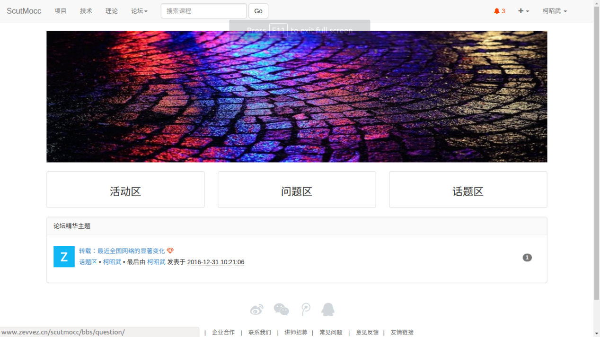  
在论坛首页提供了进入活动区、问题区、话题区三个版块的入口，展示论坛的精华主题，显示的精华主题不会超过10个。展示的精华主题后面的计数为点赞数，注意版块内的主题的计数为回复数。

## 论坛版块
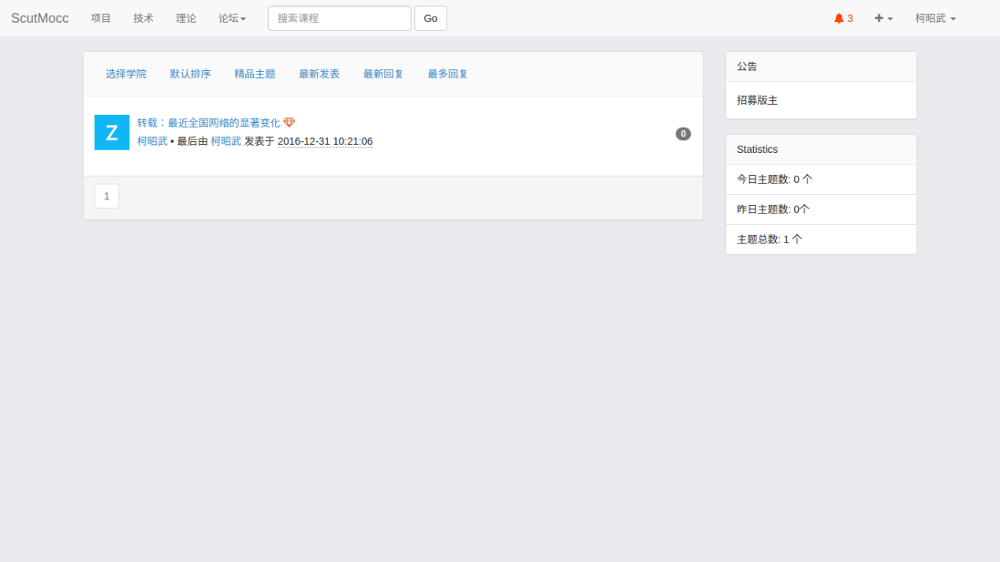  
在论坛首页进入某个版块（这里以话题区为例）之后，可以看到上图所示的内容。

### 显示主题
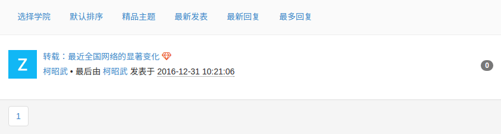  
可以根据主题的学院类型、精品主题、最新发表、最新回复、最多回复对主题进行筛选和排序。

### 版块信息
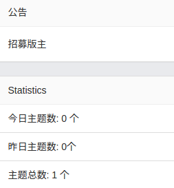  
公告为管理员在后台设置的，数据统计是后台自动统计的，包括了今日主题数、昨日主题数和主题总数。

## 查看主题
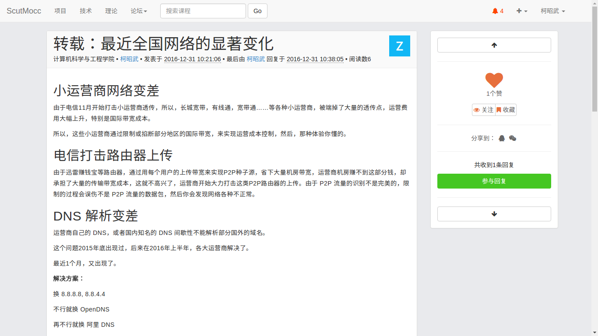  
### 主题信息
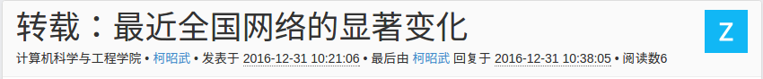  
显示了主题的标题、所属的学院、作者、发表时间、最近的动态和阅读数。
### 主题内容
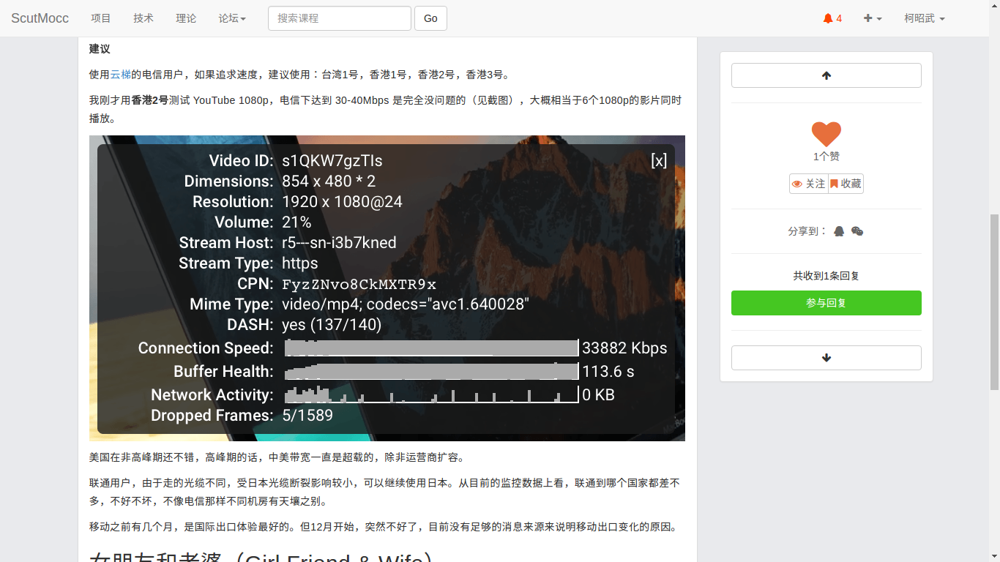  
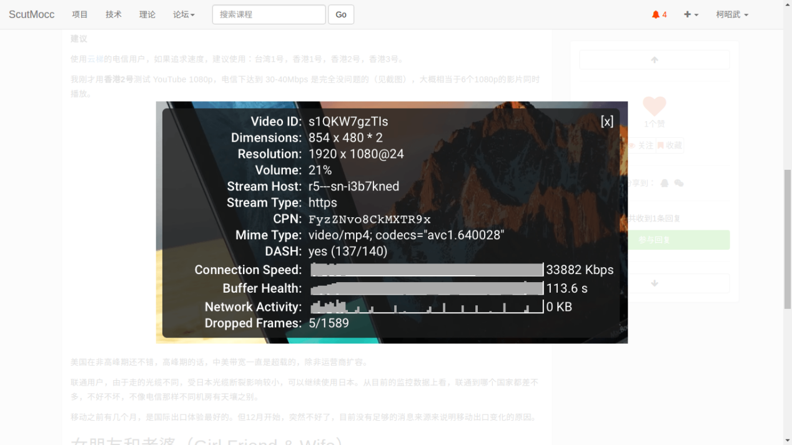  
支持各种排版的显示，支持图片的放大查看。
### 回复主题
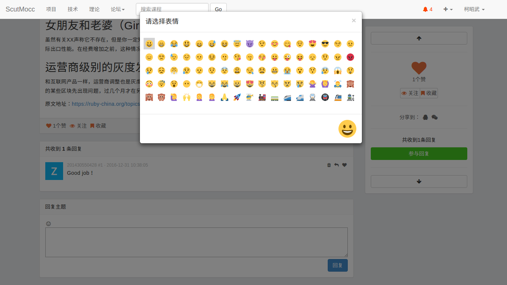  
回复时可以使用表情。回复时可以以@+用户的名字+空格的形式通知用户。只有登录的用户才可以回复主题。
### 显示回复
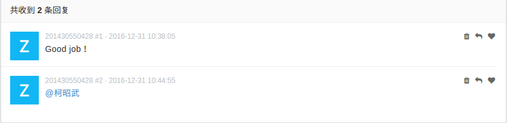  
用户可以删除自己的回复，其他用户可以回复这条评论，也可以对回复点赞。
### 对主题的管理
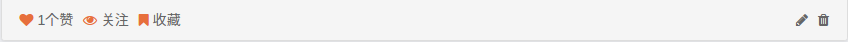  
主题的作者可以对主题进行修改和删除。
### 修改主题
点击上图铅笔的图标可以进入对主题的修改。
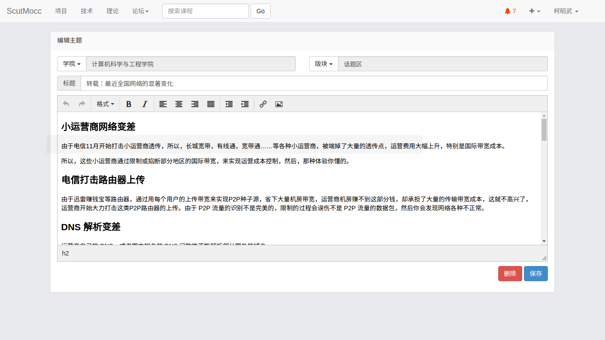  
### 删除主题
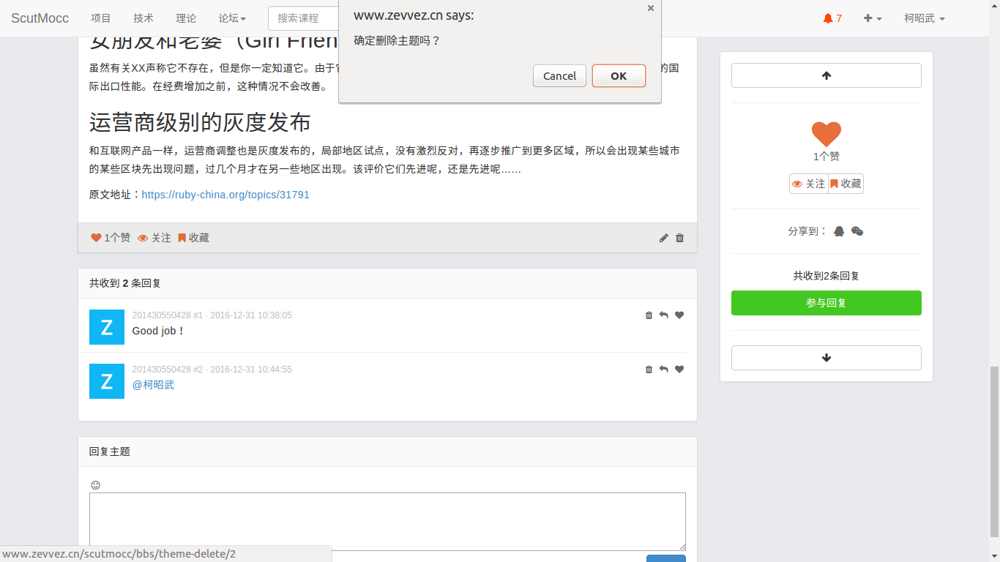  
确认删除主题后会回到论坛首页。
### 对主题的其他操作
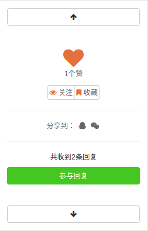  
已经登录的用户可以对主题进行点赞、对作者进行关注和收藏主题；分享功能暂时没有实现；可以点击参与回复按钮快速进行回复。

## 查看消息
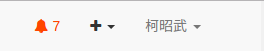  
点击小铃铛图标可以进入消息管理界面。页面会在每次刷新的时候更新未读消息的数量。
### 消息管理
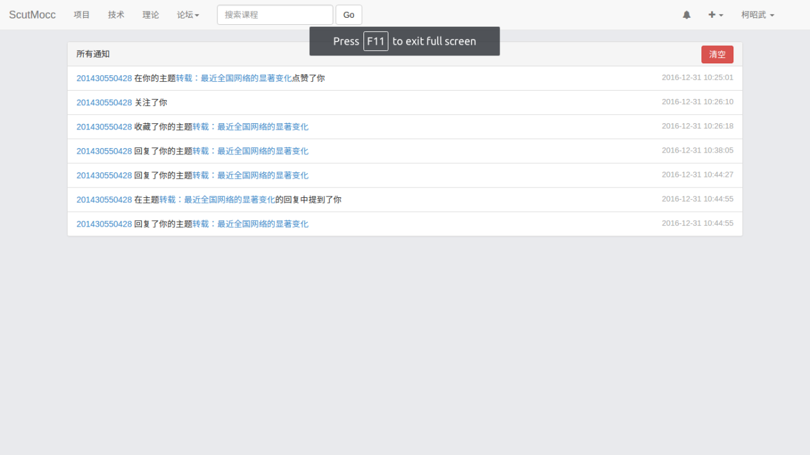  
进入消息管理后，未读消息的数量会变为0，消息的类型主要分为6类，包括点赞、关注、收藏、回复主题、@提及、回复评论。点击链接就可以跳转到对应的主题页面。点击清空按钮会清空所有的历史信息。  
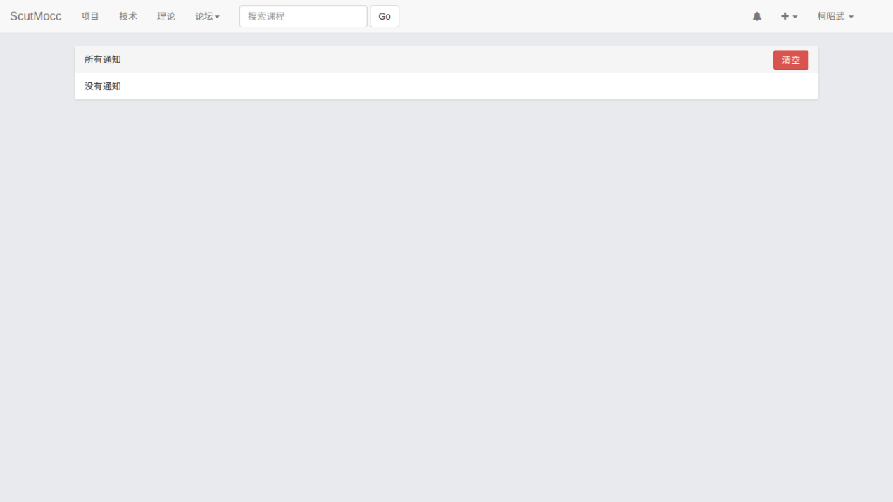  

## 发表主题
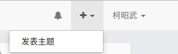  
点击导航栏上面的+图标可以进入编辑主题的页面。只有登录的用户才可以发表主题。  
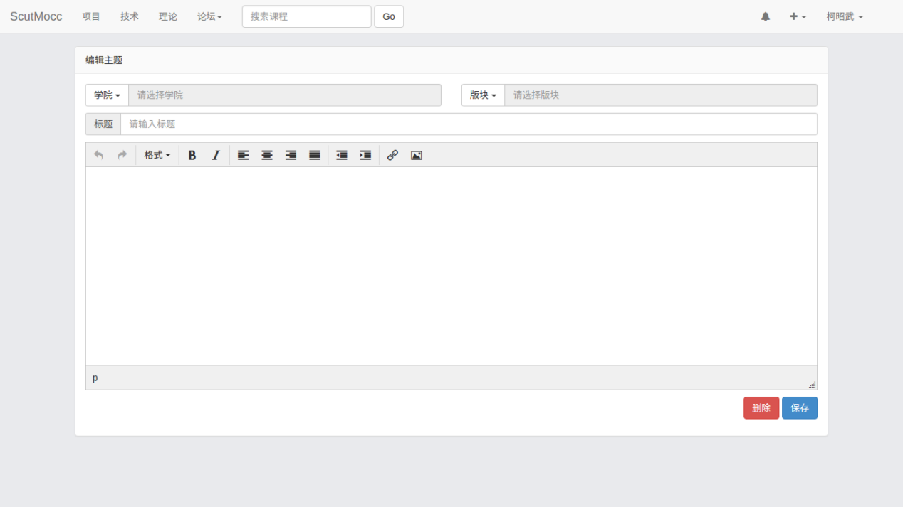  
这里所有的信息都是必填的，否则会给出错误信息。  
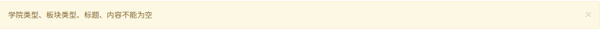  
